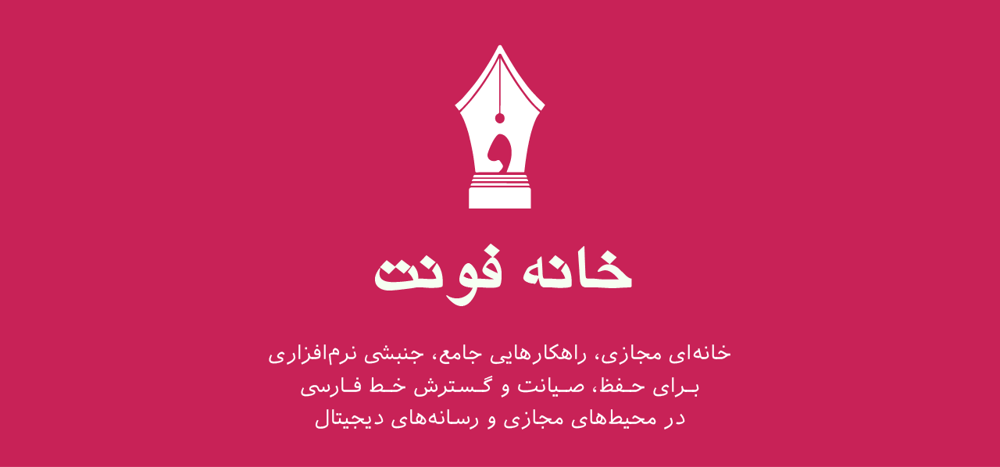

# MiladAzad - Persian/Arabic font project

MiladAzad is a  Persian/Arabic typeface, suitable for text.

MiladAzad is new redesigned version from Milad typeface by Reza Bakhtiari fard.

# درباره فونت

میلاد آزاد ویرایش جدید/بازطراحی شده تایپ‌فیس میلاد میباشد. تایپ فیس میلاد توسط رضا بختیاری فرد ([سر دسته مافیا](http://saleh.soozanchi.ir/%D8%B1%D8%B6%D8%A7-%D8%A8%D8%AE%D8%AA%DB%8C%D8%A7%D8%B1%DB%8C%E2%80%8C%D9%81%D8%B1%D8%AF/)، و کاسب‌ترین [کاسب قلم](http://rangmagazine.com/?type=dynamic&lang=1&id=3654) مطرح فونت فارسی شناخته ‌میشود.) طراحی شده است.

تایپ فیس میلاد و سایر تایپ‌فیس‌های این طراح حرفه‌ای و باسواد بواسطه مجوزی که در زیر می‌بینید مجدد بازطراحی شدند.

 این هم ذکر منبع : [منبع](https://www.behance.net/gallery/9236171/Milad-Typeface-)
 
هاها

# وضعیت توسعه

این فونت در مراحل اولیه بازطراحی و پیاده سازی قرار دارد.
در صورت مشاهده هرگونه اشکال لطفا آن را گزارش نمایید.

Version : 0.0.3
Demo : [here](http://font-store.github.io/font-MiladAzad/online/)

------
به دلیل تعدد بالای فونت‌هایی که می‌بایست منتشر گردد روند توسعه این فونت امکان دارد به کندی پیش رود.

اولویت توسعه فونت‌ها بستگی به این دارد که چقدر مورد محبوبیت مصرف کنندگانش  قرار بگیرد. معیار هم  تعداد حمایت‌های مالی دریافت شده برای هر فونت می‌باشد.

# برنامه توسعه

این فونت تا 9 وزن مختلف کشش دارد.

# حمایت و مشارکت در توسعه فونت 

پروسه و روند توسعه یک فونت کاریست بسیار ظریف و دقیق و بسیار زمان‌بر که میبایست با صبر و حوصله فراوان صورت گیرد. توسعه یک فونت شاید توسط یک شخص یا گروه در ابتدا آغاز گردد، اما در نهایت این فونت باید مورد تایید مصرف کنندگانش قرار گیرید و این به این معنی است که هر فونتی خواسته یا ناخواسته میبایست مخاطبین خود را مورد پوشش قرار داده  و نظرات آنها را دریافت و در تغییرات لحاظ نماید. و این تنها راهی اسیت که میشود به یک فونت فونت خوب و ایدعال دست پیدا کرد.

شما می‌توانید به دو صورت در توسعه این فونت مشارکت یا با ما سهیم شوید:

۱- در ابتدا باید یاد آوری نماییم که فراموش نکنید که این فونت یک پروژه آزاد هست، متعلق به یک شخص و یا گروه خاص نمی‌باشد ویعنی مالکیت عمومی دارد. پس خیلی راحت و بدون هیچ عذر و بهانه‌ای در مورد فونت، چهره حروف  و … نظرات خود را با ما درمیان بگذارید. یا اصلا آستین بالا زده و با ما در بهتر شدن و تکمیل این فونت همکاری نمایید. بنده هیچ ناراحت نمی‌شوم برعکس شدیدا منتظر انتقاد و پیشنهادات شما هستم.

۲- راه دیگر حمایت مالی ایست.خوب میدانید که در شرایط فعلی ایران مخارج زندگی بسیار پر هزینه است، و اینگونه پروژه‌ها نیاز به مشارکت عمومی یا اسپانسر مالی دارد.  شما می توانید با حمایت مالی که در توانتان هست در رسالت «حفظ و صیانت و گسترش خط فارسی در رسانه‌های دیجیتال» با من سهیم شوید تا با هم وبه کمک هم و  همکاری هم از این هویت ملی پاسداری نماییم.

جهت حمایت مالی هم می‌توانید از طریق این [لینک]   (https://www.payping.ir/d/mHMv) اقدام نمایید.

## Preview

